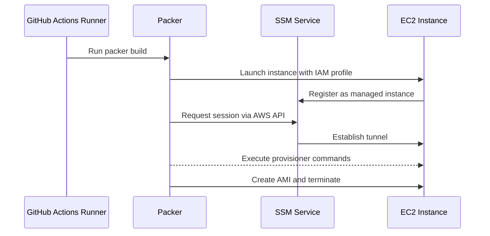

# SSM Connectivity Fix for GitHub Actions

## Problem

When building custom AMIs using Packer in GitHub Actions, the workflow fails with:

```
Timeout waiting for SSH.
```

This happens because:
1. **GitHub Actions runners have dynamic IPs** that change frequently
2. **Network restrictions** may prevent direct SSH connections to EC2 instances
3. **Security group rules** based on the runner's IP may not work reliably

## Solution: AWS Systems Manager (SSM) Session Manager

Instead of SSH over the network, Packer now uses **AWS Systems Manager Session Manager**, which:
- ✅ **No SSH required** - Uses AWS APIs instead
- ✅ **No security group rules needed** - Connections go through AWS service endpoints
- ✅ **No public IP required** - Works with private subnets too
- ✅ **More secure** - Uses IAM roles and policies
- ✅ **Better logging** - All sessions logged in CloudTrail

## What Changed

### 1. Packer Configuration (`github-runner-ami.pkr.hcl`)

**Before:**
```hcl
source "amazon-ebs" "ubuntu" {
  # ...
  temporary_security_group_source_public_ip = true
}
```

**After:**
```hcl
source "amazon-ebs" "ubuntu" {
  # ...
  communicator              = "ssh"
  ssh_interface             = "session_manager"
  iam_instance_profile      = "PackerSSMInstanceProfile"
}
```

### 2. IAM Resources (`iam-setup.yml`)

Created CloudFormation stack with:
- **IAM Role** (`PackerSSMRole`) - Allows EC2 to use SSM
- **Instance Profile** (`PackerSSMInstanceProfile`) - Attached to Packer build instances
- **Managed Policy** (`AmazonSSMManagedInstanceCore`) - Provides SSM permissions

### 3. GitHub Actions Workflow (`build-custom-ami.yml`)

Added two new steps:

**Step 1: Setup IAM resources**
```yaml
- name: Setup Packer IAM resources
  run: |
    aws cloudformation create-stack \
      --stack-name packer-ssm-iam-stack \
      --template-body file://iam-setup.yml \
      --capabilities CAPABILITY_NAMED_IAM
```

**Step 2: Install Session Manager Plugin**
```yaml
- name: Install AWS Session Manager Plugin
  run: |
    curl "https://s3.amazonaws.com/session-manager-downloads/plugin/latest/ubuntu_64bit/session-manager-plugin.deb" \
      -o "session-manager-plugin.deb"
    sudo dpkg -i session-manager-plugin.deb
```

## How It Works



## One-Time Setup

The IAM resources are created automatically by the workflow, but you can also create them manually:

```bash
cd AWS/packer
aws cloudformation create-stack \
  --stack-name packer-ssm-iam-stack \
  --template-body file://iam-setup.yml \
  --capabilities CAPABILITY_NAMED_IAM \
  --region eu-west-2
```

**Note:** The CloudFormation stack only needs to be created once per AWS account/region. Subsequent workflow runs will reuse the existing resources.

## Verification

To verify the IAM resources exist:

```bash
# Check CloudFormation stack
aws cloudformation describe-stacks \
  --stack-name packer-ssm-iam-stack \
  --region eu-west-2

# Check IAM role
aws iam get-role --role-name PackerSSMRole

# Check instance profile
aws iam get-instance-profile --instance-profile-name PackerSSMInstanceProfile
```

## Required Permissions

Your GitHub Actions OIDC role needs these additional permissions:

```json
{
  "Version": "2012-10-17",
  "Statement": [
    {
      "Effect": "Allow",
      "Action": [
        "cloudformation:CreateStack",
        "cloudformation:DescribeStacks",
        "cloudformation:DeleteStack"
      ],
      "Resource": "arn:aws:cloudformation:*:*:stack/packer-ssm-iam-stack/*"
    },
    {
      "Effect": "Allow",
      "Action": [
        "iam:CreateRole",
        "iam:GetRole",
        "iam:AttachRolePolicy",
        "iam:CreateInstanceProfile",
        "iam:GetInstanceProfile",
        "iam:AddRoleToInstanceProfile",
        "iam:PassRole"
      ],
      "Resource": [
        "arn:aws:iam::*:role/PackerSSMRole",
        "arn:aws:iam::*:instance-profile/PackerSSMInstanceProfile"
      ]
    },
    {
      "Effect": "Allow",
      "Action": [
        "ssm:StartSession",
        "ssm:TerminateSession",
        "ssm:DescribeSessions"
      ],
      "Resource": "*"
    }
  ]
}
```

## Troubleshooting

### CloudFormation stack already exists
If the stack already exists from a previous run, the workflow will skip creation and reuse it.

### SSM not connecting
Check that:
1. Instance profile is attached: `PackerSSMInstanceProfile`
2. SSM agent is running (it's pre-installed on Ubuntu 22.04 AMIs)
3. IAM role has `AmazonSSMManagedInstanceCore` policy

### Session Manager plugin not found
The workflow installs it automatically. For local builds:

**macOS:**
```bash
brew install --cask session-manager-plugin
```

**Linux:**
```bash
curl "https://s3.amazonaws.com/session-manager-downloads/plugin/latest/ubuntu_64bit/session-manager-plugin.deb" -o "session-manager-plugin.deb"
sudo dpkg -i session-manager-plugin.deb
```

**Windows:**
Download from: https://docs.aws.amazon.com/systems-manager/latest/userguide/session-manager-working-with-install-plugin.html

## Cost Impact

**No additional costs** for using SSM Session Manager:
- SSM sessions are **free**
- No data transfer charges within same region
- CloudFormation stack has no ongoing costs

## Security Benefits

1. **No exposed SSH ports** - Security groups don't need port 22 open
2. **IAM-based access** - Fine-grained control via IAM policies
3. **Session logging** - All sessions logged in CloudTrail
4. **No SSH keys** - No need to manage or rotate SSH keys
5. **MFA support** - Can require MFA for SSM sessions

## References

- [Packer Amazon SSM Proxy](https://www.packer.io/plugins/builders/amazon/ebs#session_manager_port)
- [AWS Session Manager](https://docs.aws.amazon.com/systems-manager/latest/userguide/session-manager.html)
- [Session Manager Plugin Installation](https://docs.aws.amazon.com/systems-manager/latest/userguide/session-manager-working-with-install-plugin.html)

## Rollback (if needed)

To revert to SSH-based connectivity:

1. Update `github-runner-ami.pkr.hcl`:
   ```hcl
   source "amazon-ebs" "ubuntu" {
     # Remove SSM settings
     # ssh_interface        = "session_manager"
     # iam_instance_profile = "PackerSSMInstanceProfile"
     
     # Add back
     temporary_security_group_source_public_ip = true
   }
   ```

2. Remove IAM setup steps from workflow

**Not recommended** - SSH will still fail intermittently with GitHub Actions runners.
