# Azure Deployment Checklist - Post AWS Parity Update

## ✅ Changes Completed

### 1. **Native Nginx Architecture** ✅
- Replaced Docker Nginx container with native systemd service
- Matches AWS implementation exactly

### 2. **Consolidated Configuration** ✅
- Single `upstreams.conf` for all backends
- Single `locations.conf` for all routes
- Eliminates server block conflicts

### 3. **Path Rewriting Logic** ✅
- Added `rewrite ^/dev/<service>/(.*) /$1 break;`
- Applications receive expected paths

### 4. **IP-Based Routing** ✅
- jq-based IP extraction from Docker network
- More reliable than Go templates

### 5. **Automated Config Regeneration** ✅
- `rebuild_all_configs()` on any container change
- Ensures consistency across deployments

### 6. **GitHub Runner Access** ✅
- Runner user added to docker group
- Service restart after docker installation

## 🚀 Deployment Steps

### Step 1: Deploy Azure Infrastructure

```bash
# Option A: GitHub Actions (Recommended)
# 1. Go to: https://github.com/YOUR_ORG/YOUR_REPO/actions
# 2. Select workflow: "Deploy Azure Infrastructure (OIDC)"
# 3. Click "Run workflow"
# 4. Select:
#    - Environment: dev
#    - Azure Region: eastus (or your preferred region)
# 5. Click "Run workflow"

# Option B: Local Deployment
cd infrastructure/Azure/terraform
terraform init
terraform plan
terraform apply
```

**Expected Output:**
```
Apply complete! Resources: X added, 0 changed, 0 destroyed.

Outputs:
resource_group_name = "testcontainers-dev-rg"
vm_private_ip = "10.0.1.4"
github_actions_app_id = "12345678-1234-1234-1234-123456789abc"
```

### Step 2: Verify Infrastructure

```bash
# Check Azure resources
az resource list --resource-group testcontainers-dev-rg --output table

# Check GitHub runner status
# Navigate to: Settings > Actions > Runners
# Expected: "azure-vm-runner-dev" status = "Idle" ✅
```

### Step 3: Verify Nginx Services (SSH/Bastion)

**Via Azure CLI Run Command:**
```bash
# Get VM resource ID
VM_ID=$(az vm show -g testcontainers-dev-rg -n testcontainers-dev-vm --query id -o tsv)

# Check nginx status
az vm run-command invoke \
  --ids $VM_ID \
  --command-id RunShellScript \
  --scripts "systemctl status nginx"

# Check auto-config service
az vm run-command invoke \
  --ids $VM_ID \
  --command-id RunShellScript \
  --scripts "systemctl status nginx-auto-config"

# Check logs
az vm run-command invoke \
  --ids $VM_ID \
  --command-id RunShellScript \
  --scripts "tail -50 /var/log/nginx-auto-config.log"
```

**Expected nginx-auto-config.log:**
```
[2024-11-24 10:00:00] Initializing: scanning existing containers on app-network...
[2024-11-24 10:00:00] Rebuilding all container configurations...
[2024-11-24 10:00:00] No containers to configure
[2024-11-24 10:00:00] Monitoring Docker events...
```

✅ **This is correct!** No containers yet - apps not deployed.

### Step 4: Deploy Applications

```bash
# Option A: GitHub Actions (Recommended)
# 1. Go to: https://github.com/YOUR_ORG/YOUR_REPO/actions
# 2. Select workflow: "Deploy SIT Environment (Generic)"
# 3. Click "Run workflow"
# 4. Select:
#    - Environment: dev
#    - Runner label: azure (or azure-vm-runner-dev)
# 5. Click "Run workflow"

# Option B: Manual SSH Deployment (if SSH enabled)
ssh azureuser@<vm-ip>
cd /opt/app
docker compose -f docker-compose-with-nginx.yml up -d
```

**Expected Output:**
```
✅ beneficiaries container started
✅ paymentprocessor container started
✅ paymentconsumer container started
✅ Database containers started
```

### Step 5: Verify Auto-Configuration

```bash
# Check nginx-auto-config logs
az vm run-command invoke \
  --ids $VM_ID \
  --command-id RunShellScript \
  --scripts "tail -100 /var/log/nginx-auto-config.log"
```

**Expected Log Output:**
```
[2024-11-24 10:05:00] Event: start for beneficiaries
[2024-11-24 10:05:02] Rebuilding all container configurations...
[2024-11-24 10:05:02] Found container: beneficiaries at 172.18.0.5:8080 path /dev/beneficiaries
[2024-11-24 10:05:02] Found container: paymentprocessor at 172.18.0.6:8081 path /dev/paymentprocessor
[2024-11-24 10:05:02] Found container: paymentconsumer at 172.18.0.7:8082 path /dev/paymentconsumer
[2024-11-24 10:05:02] Generating consolidated nginx configuration...
[2024-11-24 10:05:02] Testing nginx configuration...
[2024-11-24 10:05:02] ✅ Consolidated config created and loaded
[2024-11-24 10:05:02]    Upstreams: /etc/nginx/conf.d/auto-generated/upstreams.conf
[2024-11-24 10:05:02]    Locations: /etc/nginx/conf.d/auto-generated/locations.conf
```

### Step 6: Verify Generated Configs

```bash
# Check upstreams.conf
az vm run-command invoke \
  --ids $VM_ID \
  --command-id RunShellScript \
  --scripts "cat /etc/nginx/conf.d/auto-generated/upstreams.conf"

# Check locations.conf
az vm run-command invoke \
  --ids $VM_ID \
  --command-id RunShellScript \
  --scripts "cat /etc/nginx/conf.d/auto-generated/locations.conf"
```

**Expected upstreams.conf:**
```nginx
# Auto-generated upstreams - Sun Nov 24 10:05:02 UTC 2024
upstream beneficiaries_backend {
    server 172.18.0.5:8080;
    keepalive 32;
}
upstream paymentprocessor_backend {
    server 172.18.0.6:8081;
    keepalive 32;
}
upstream paymentconsumer_backend {
    server 172.18.0.7:8082;
    keepalive 32;
}
```

**Expected locations.conf:**
```nginx
# Auto-generated locations - Sun Nov 24 10:05:02 UTC 2024
# These locations are included in the main server block

location /dev/beneficiaries/ {
    rewrite ^/dev/beneficiaries/(.*) /$1 break;
    proxy_pass http://beneficiaries_backend;
    proxy_set_header Host $host;
    proxy_set_header X-Real-IP $remote_addr;
    proxy_set_header X-Forwarded-For $proxy_add_x_forwarded_for;
    proxy_set_header X-Forwarded-Proto $scheme;
    proxy_http_version 1.1;
    proxy_set_header Connection "";
    proxy_connect_timeout 60s;
    proxy_send_timeout 60s;
    proxy_read_timeout 60s;
}

location /dev/paymentprocessor/ {
    rewrite ^/dev/paymentprocessor/(.*) /$1 break;
    proxy_pass http://paymentprocessor_backend;
    ...
}

location /dev/paymentconsumer/ {
    rewrite ^/dev/paymentconsumer/(.*) /$1 break;
    proxy_pass http://paymentconsumer_backend;
    ...
}
```

### Step 7: Test Endpoints

```bash
# Get VM public IP (if configured) or use Azure Bastion
VM_IP=$(az vm show -g testcontainers-dev-rg -n testcontainers-dev-vm --query "privateIps" -o tsv)

# From sit-test-repo directory
cd sit-test-repo
export ALB_URL="http://$VM_IP"
./test-all-endpoints.sh
```

**Expected Output:**
```
🏥 Testing Health Checks...
✅ Beneficiaries health check passed
✅ Payment Processor health check passed
✅ Payment Consumer health check passed

👥 Testing Beneficiaries Service...
✅ Created beneficiary: 12345
✅ Retrieved beneficiary: 12345
✅ Listed all beneficiaries
✅ Updated beneficiary: 12345
✅ Deleted beneficiary: 12345

💳 Testing Payment Processor...
✅ Created payment: 67890
✅ Retrieved payment: 67890
✅ Listed all payments
✅ Updated payment: 67890

🔄 Testing Payment Consumer...
✅ Orchestrated payment flow: ABCDE
✅ Retrieved orchestration: ABCDE

📊 Test Summary:
PASSED: 15/15
FAILED: 0/15
```

### Step 8: Compare with AWS

Verify Azure behaves identically to AWS:

```bash
# AWS endpoints (for comparison)
export AWS_ALB_URL="http://testco20251124090742466900000008-1500449415.eu-west-2.elb.amazonaws.com"

# Test AWS
ALB_URL=$AWS_ALB_URL ./test-all-endpoints.sh > aws-results.txt

# Test Azure
ALB_URL="http://$VM_IP" ./test-all-endpoints.sh > azure-results.txt

# Compare
diff aws-results.txt azure-results.txt
```

**Expected:** No differences in endpoint behavior! ✅

## 🔍 Verification Checklist

- [ ] Azure infrastructure deployed successfully
- [ ] nginx service running on port 80
- [ ] nginx-auto-config service active and monitoring
- [ ] GitHub runner registered and idle
- [ ] Applications deployed via GitHub Actions
- [ ] Containers detected on app-network
- [ ] upstreams.conf generated with IP addresses
- [ ] locations.conf generated with path rewriting
- [ ] Nginx reloaded automatically
- [ ] All health checks return 200 OK
- [ ] CRUD operations work correctly
- [ ] Payment processing works correctly
- [ ] Payment consumer orchestration works
- [ ] test-all-endpoints.sh passes all tests
- [ ] Behavior identical to AWS deployment

## ⚠️ Troubleshooting

### Issue: "No containers to configure"

**Cause:** Applications not deployed yet (expected before app deployment)

**Solution:** Deploy apps via GitHub Actions or docker compose

### Issue: "Nginx config test failed"

```bash
# Check nginx syntax
az vm run-command invoke \
  --ids $VM_ID \
  --command-id RunShellScript \
  --scripts "nginx -t"

# Check error log
az vm run-command invoke \
  --ids $VM_ID \
  --command-id RunShellScript \
  --scripts "tail -50 /var/log/nginx/error.log"
```

### Issue: "Containers not detected"

```bash
# Check Docker network
az vm run-command invoke \
  --ids $VM_ID \
  --command-id RunShellScript \
  --scripts "docker network inspect app-network"

# Check container labels
az vm run-command invoke \
  --ids $VM_ID \
  --command-id RunShellScript \
  --scripts "docker inspect beneficiaries | jq '.[0].Config.Labels'"
```

### Issue: "503 Service Unavailable"

**Possible Causes:**
1. Backend container not running
2. Wrong IP address in upstreams.conf
3. Wrong port in upstreams.conf

**Solution:**
```bash
# Check containers
az vm run-command invoke \
  --ids $VM_ID \
  --command-id RunShellScript \
  --scripts "docker ps --filter 'network=app-network'"

# Force rebuild
az vm run-command invoke \
  --ids $VM_ID \
  --command-id RunShellScript \
  --scripts "systemctl restart nginx-auto-config"
```

### Issue: "404 Not Found" or "500 Internal Server Error"

**Cause:** Path rewriting not working or wrong backend path

**Check:**
1. Verify location paths have trailing slash: `location /dev/beneficiaries/`
2. Verify rewrite rule present: `rewrite ^/dev/beneficiaries/(.*) /$1 break;`
3. Verify application expects: `/api/v1/beneficiaries` not `/dev/beneficiaries/api/v1/beneficiaries`

```bash
# Test direct backend access
az vm run-command invoke \
  --ids $VM_ID \
  --command-id RunShellScript \
  --scripts "docker exec beneficiaries curl -s http://localhost:8080/health"
```

## 📋 Key Differences: Azure vs AWS

| Feature | AWS | Azure | Notes |
|---------|-----|-------|-------|
| **Nginx** | Native systemd | Native systemd | ✅ Identical |
| **Config Approach** | Consolidated | Consolidated | ✅ Identical |
| **Path Rewriting** | Yes | Yes | ✅ Identical |
| **IP Extraction** | jq | jq | ✅ Identical |
| **Auto-Config** | rebuild_all_configs() | rebuild_all_configs() | ✅ Identical |
| **Load Balancer** | ALB | None | Azure uses VM public IP |
| **User Account** | ubuntu | azureuser | Different defaults |
| **Cloud Init** | user-data.sh | cloud-init.yaml | Different formats, same logic |
| **OIDC Provider** | AWS OIDC | Azure AD | Cloud-specific |

**All nginx and application logic identical!** ✅

## 📖 Reference Documents

- **AZURE_AWS_PARITY.md**: Detailed technical changes
- **README.md**: Azure infrastructure overview
- **OIDC_GUIDE.md**: OIDC setup and troubleshooting
- **../AWS/user-data.sh**: AWS reference implementation (lines 290-550)
- **cloud-init.yaml**: Azure implementation

## ✅ Success Criteria

Your Azure deployment is successful when:

1. ✅ Infrastructure deploys without errors
2. ✅ nginx and nginx-auto-config services running
3. ✅ GitHub runner registered and accepting jobs
4. ✅ Applications deploy via GitHub Actions
5. ✅ Configs auto-generate when containers start
6. ✅ All endpoints return expected responses
7. ✅ test-all-endpoints.sh shows: PASSED: 15/15
8. ✅ No manual nginx configuration required
9. ✅ Behavior identical to AWS
10. ✅ Future deployments work automatically

## 🎯 Next Deployment Flow

```mermaid
graph TD
    A[Run: azure-infrastructure-oidc workflow] --> B[Azure VM created]
    B --> C[nginx + auto-config installed]
    C --> D[GitHub runner registered]
    D --> E[Run: sit-environment-generic workflow]
    E --> F[Containers deployed to app-network]
    F --> G[nginx-auto-config detects containers]
    G --> H[Configs generated automatically]
    H --> I[Nginx reloaded]
    I --> J[Endpoints accessible]
    J --> K[Run: test-all-endpoints.sh]
    K --> L{All tests pass?}
    L -->|Yes| M[✅ Deployment complete!]
    L -->|No| N[Check logs and troubleshoot]
```



---

**Ready to deploy!** Follow steps 1-8 above for your next Azure deployment. 🚀
